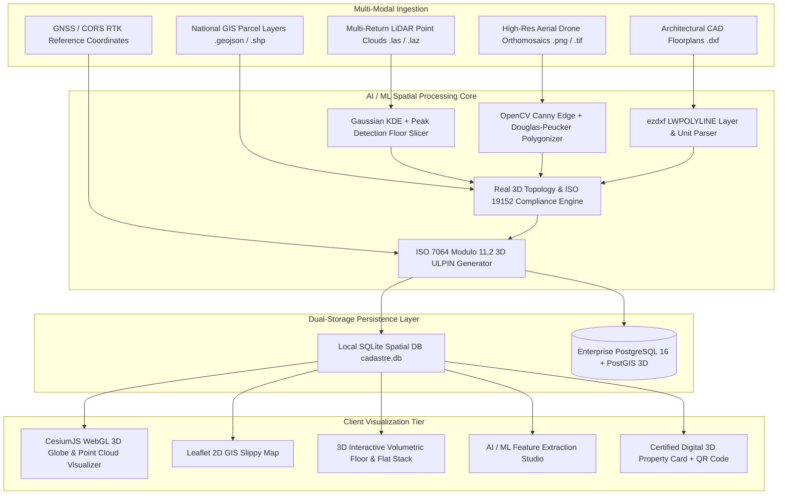

# 🏗️ 3D ULPIN Cadastre — System Architecture & Technical Specifications

## 1. System Overview

The **3D ULPIN (Unique Land Parcel Identification Number) & Vertical Property Cadastre System** is a next-generation land administration platform designed to overcome the spatial limitations of legacy 2D cadastres in dense, multi-tiered urban environments.

The system natively supports:
- **Surface Land Parcels (2D / 2.5D)**
- **Multi-Storey High-Rise Buildings & Vertical Stratum Units (Flats / Apartments)**
- **Subterranean Infrastructure (Metro / Rail Tunnels, Utility Easements, Pipelines)**
- **Protected Air-Rights & Sky Corridor Envelopes**

---

## 2. Architectural Blueprint

---

## 3. Data Integration & AI/ML Pipeline

### 3.1 Point Cloud Floor Slicing (LiDAR)
- **Algorithm**: Continuous 1D Gaussian Kernel Density Estimation (KDE) with SciPy peak detection.
- **Objective**: Identifies concrete floor slabs, double-height podiums, and refuge floors along the vertical $Z$-axis with $\pm 0.03\text{m}$ vertical accuracy.

### 3.2 Drone Building Footprint Extraction (Computer Vision)
- **Algorithm**: OpenCV Adaptive Thresholding, Canny Edge Detection, Morphological Closing, and Douglas-Peucker polygon approximation (`cv2.approxPolyDP`).
- **Georeferencing**: Affine WGS84 GPS coordinate transformation mapping pixel bounding polygons to EPSG:4326 Lat/Lon.

### 3.3 Architectural Floorplan CAD Parsing
- **Algorithm**: `ezdxf` extraction of closed `LWPOLYLINE` boundaries on `A-AREA-UNITS`, text extraction from `MTEXT`, and Shoelace formula area computation for net carpet and gross built-up areas.

### 3.4 3D Topology Validation Engine (ISO 19152 LADM)
Executes 5 geometric audits:
1. **Euler Polyhedral Watertightness**: Verifies $V - E + F = 2$ on unit solid prisms.
2. **Volumetric Overlap**: Verifies $Interior(A) \cap Interior(B) = \emptyset$.
3. **Sub-surface Buffer Clearance**: Euclidean point-to-segment distance from building footings to subsurface pipelines and tunnels.
4. **UDS Proportional Balance**: $\sum UDS_i = 100\%$.
5. **Airspace Ceiling Bounds**: $Z_{max} \le \text{Roof MSL}$.

---

## 4. Standardized 3D ULPIN (Bhu-Aadhaar 3D) Structure

The 20-character standardized 3D ULPIN format is structured as follows:

$$\underbrace{\text{IN}}_{\text{Country}}-\underbrace{\text{MH}}_{\text{State}}-\underbrace{\text{PUN}}_{\text{District}}-\underbrace{\text{HINJ}}_{\text{Locality}}-\underbrace{\text{UN}}_{\text{Layer}}-\underbrace{\text{000501}}_{\text{Building}}-\underbrace{\text{1402}}_{\text{Floor/Unit}}-\underbrace{\text{4}}_{\text{ISO 7064 Checksum}}$$

| Segment | Meaning | Example |
| :--- | :--- | :--- |
| **Country** | ISO 3166-1 Alpha-2 | `IN` (India), `NZ` (New Zealand) |
| **State** | 2-Letter State Code | `MH` (Maharashtra), `AUK` (Auckland) |
| **District** | 3-Letter District Code | `PUN` (Pune), `CBD` (Auckland Central) |
| **Locality** | 4-Letter Locality Code | `HINJ` (Hinjewadi), `PACF` (Pacifica Precinct) |
| **Layer** | 2-Letter Stratum Type | `PL` (Parcel), `BL` (Building), `FL` (Floor), `UN` (Unit), `UT` (Utility), `AR` (Air Rights) |
| **Building** | 6-Digit Hierarchy Index | `000501` (Tower 5) |
| **Floor/Unit** | 4-Digit Floor & Unit | `1402` (Floor 14, Flat 02) |
| **Checksum** | ISO 7064 Modulo 11,2 | Computed check digit ($0-9$ or $X$) |

